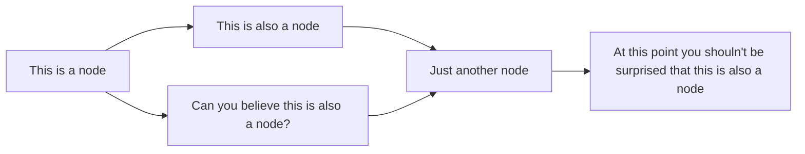
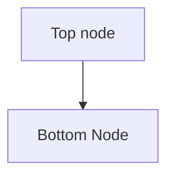
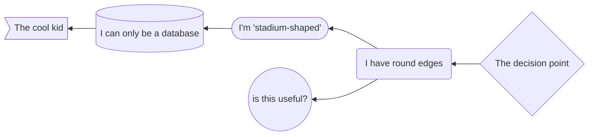

A horizontal, left to right flowchart:

```mermaid
flowchart LR
  node1[This is a node] --> node2[This is also a node]
  node1 --> node3[Can you believe this is also a node?]
  node2 --> node4[Just another node]
  node3 --> node4
  node4 --> node5[At this point you shouln't be surprised that this is also a node]
```

A vertical, top-to-bottom flowchart:

```mermaid
flowchart TD
  node1[Top node] --> node2[Bottom Node]
```

Some shapes of nodes:

```mermaid
flowchart RL
  roundNode(I have round edges) --> stadium([I'm 'stadium-shaped'])
  stadium --> database[(I can only be a database)]
  roundNode --> circle((is this useful?))
  database --> coolKid>The cool kid]
  decision{The decision point} --> roundNode
```