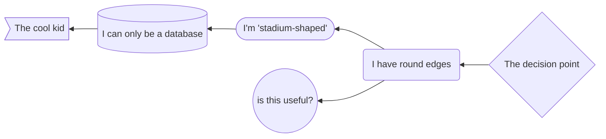

Some of the shapes of nodes:

```mermaid
flowchart RL
  roundNode(I have round edges) --> stadium([I'm 'stadium-shaped'])
  stadium --> database[(I can only be a database)]
  roundNode --> circle((is this useful?))
  database --> coolKid>The cool kid]
  decision{The decision point} --> roundNode
```
